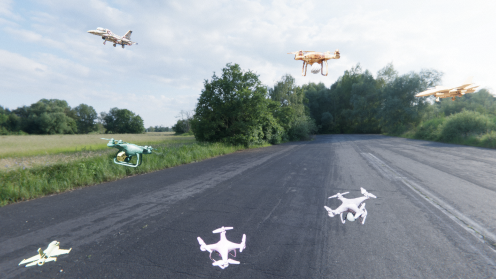
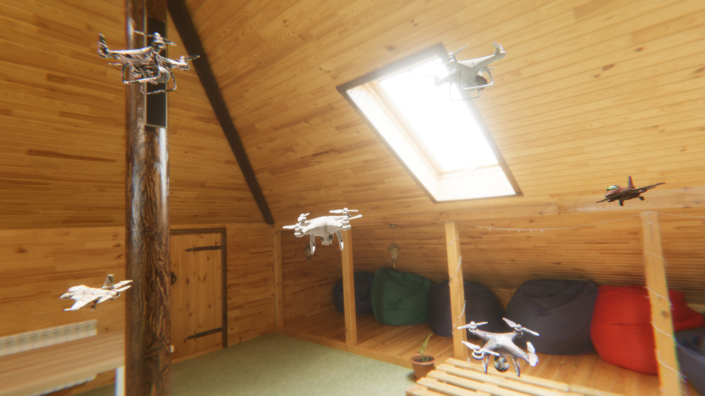
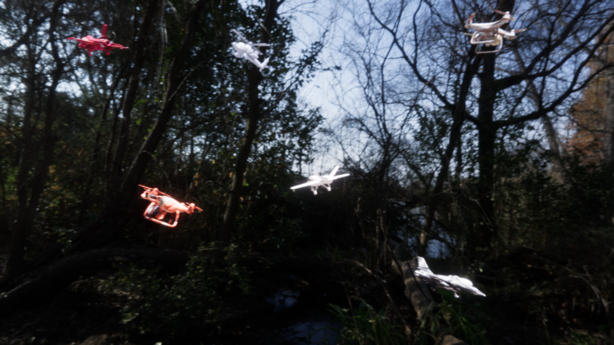
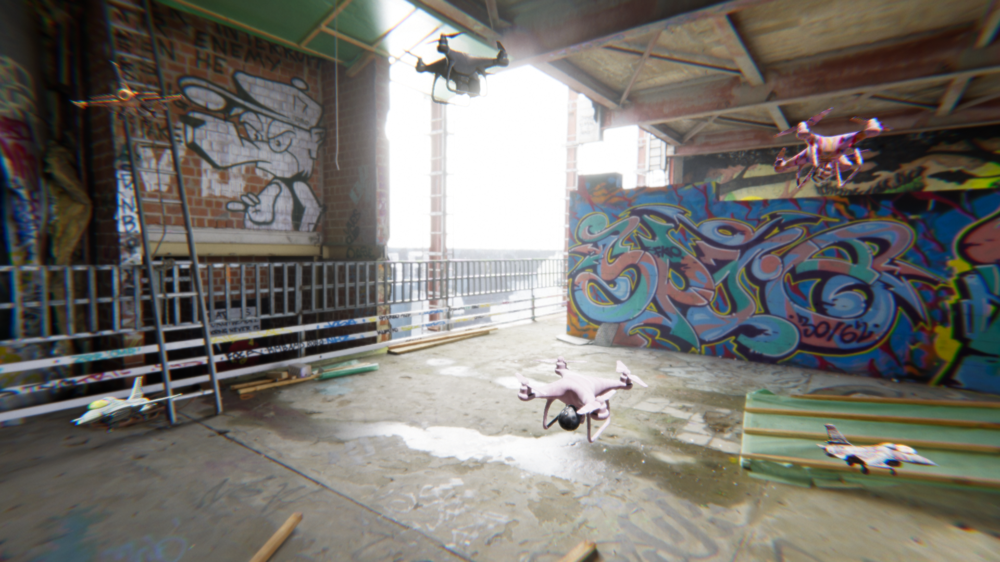
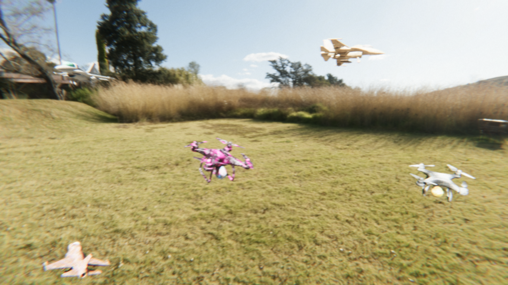
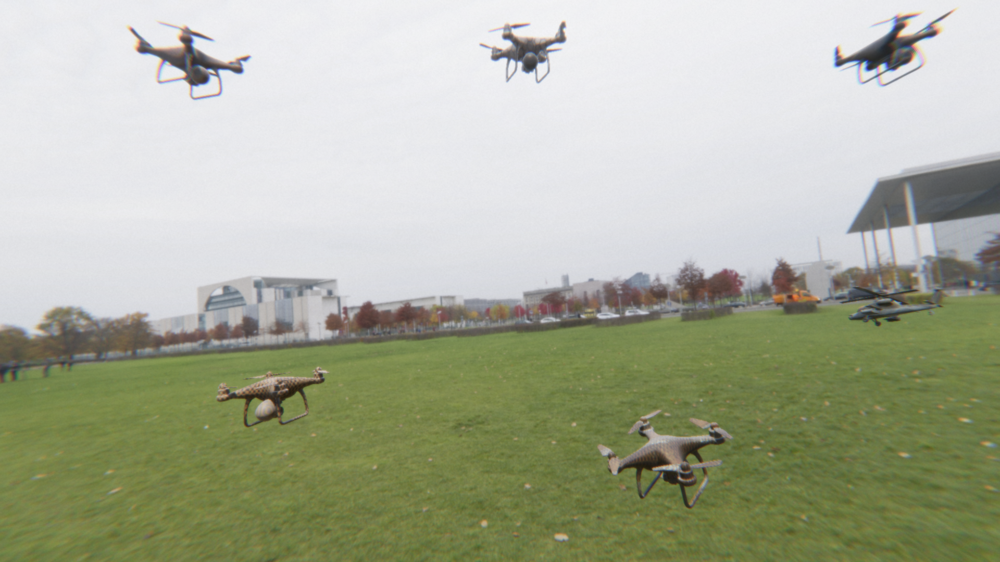
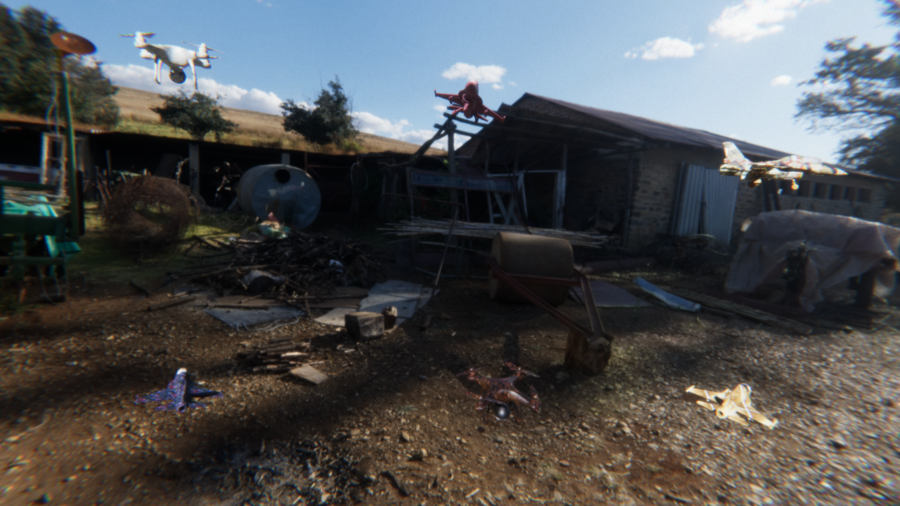
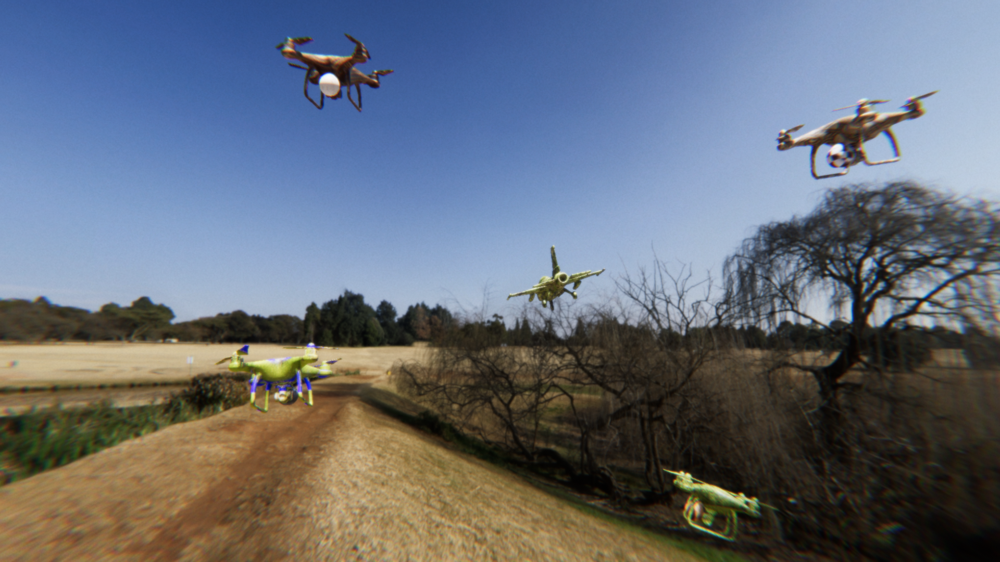

# ADS CV Data Generator

A synthetic image dataset generator built in **Unity HDRP** using the **Unity Perception Framework**, designed for the [TEKNOFEST 2026 Çelikkubbe Air Defense Systems Competition](https://teknofest.org). It produces photo-realistic, fully-annotated training images for computer vision models tasked with detecting aerial threats (balloons, UAVs, and other airborne targets) under diverse environmental conditions.

---

## Table of Contents

- [Overview](#overview)
- [Sample Images](#sample-images)
- [Controllable Parameters](#controllable-parameters)
  - [Object Spawning](#1-object-spawning)
  - [Object Rotation](#2-object-rotation)
  - [Object Scale & Distance](#3-object-scale--distance)
  - [Object Color & Material](#4-object-color--material)
  - [Camera Angle](#5-camera-angle)
  - [Sky & Environment](#6-sky--environment)
  - [Lighting](#7-lighting)
  - [Object Surface Texture](#8-object-surface-texture)
  - [Background Texture](#9-background-texture)
  - [Post-Processing / Camera Simulation](#10-post-processing--camera-simulation)
- [Architecture](#architecture)
- [Getting Started](#getting-started)
- [Competition Context](#competition-context)

---

## Overview

Training a robust object detector requires large, varied datasets. Collecting and hand-labeling real aerial footage is expensive and slow. This tool generates an unlimited supply of **automatically annotated** images by randomizing every visual factor that affects how a target looks from a camera — object pose, lighting, weather mood, camera artifacts, and more.

Each rendered frame is exported with a per-instance **segmentation mask** generated by the Unity Perception package. Bounding boxes are derived from these masks in a post-processing step rather than being written directly by the renderer.

**Tech stack:** Unity 2022.3 · HDRP · Unity Perception 1.x · C#

---

## Sample Images

Eight representative frames from the generator, showing the range of variation achievable across a single dataset:

<table>
  <tr>
    <td align="center"><br/><sub>Sequence 2</sub></td>
    <td align="center"><br/><sub>Sequence 3</sub></td>
  </tr>
  <tr>
    <td align="center"><br/><sub>Sequence 4</sub></td>
    <td align="center"><br/><sub>Sequence 5</sub></td>
  </tr>
  <tr>
    <td align="center"><br/><sub>Sequence 6</sub></td>
    <td align="center"><br/><sub>Sequence 7</sub></td>
  </tr>
  <tr>
    <td align="center"><br/><sub>Sequence 8</sub></td>
    <td align="center"><br/><sub>Sequence 9</sub></td>
  </tr>
</table>

---

## Controllable Parameters

All parameters are exposed in the **Unity Inspector** on the relevant Randomizer component and take effect per-iteration without modifying any code.

---

### 1. Object Spawning

**Script:** `ModelRandomizer.cs`

Controls which target models appear in a frame and how many.

| Parameter | Type | Default | Description |
|-----------|------|---------|-------------|
| `ModelPrefabs[]` | GameObject[] | — | Pool of prefabs to draw from (balloons, UAVs, etc.) |
| `minCount` | int | 5 | Minimum targets spawned per frame |
| `maxCount` | int | 10 | Maximum targets spawned per frame |

Objects are placed at random viewport positions (10%–90% of screen area) to avoid edge-clipping. The system retries up to 100 times per object to prevent visual overlap.

---

### 2. Object Rotation

**Script:** `ModelRandomizer.cs`

Each spawned object receives a random orientation on all three axes, applied on top of its prefab's base rotation so model-specific corrections are preserved.

| Parameter | Default Range | Description |
|-----------|--------------|-------------|
| `minRotationX` / `maxRotationX` | 0° – 360° | Pitch (nose up/down) |
| `minRotationY` / `maxRotationY` | 0° – 360° | Yaw (left/right heading) |
| `minRotationZ` / `maxRotationZ` | 0° – 360° | Roll (bank angle) |

Narrow these ranges to constrain poses — for example, set Z to 0°–0° to only produce level-flight images.

---

### 3. Object Scale & Distance

**Script:** `ModelRandomizer.cs`

Controls apparent target size in the image by varying both physical scale and camera-to-target distance.

| Parameter | Default | Description |
|-----------|---------|-------------|
| `scaleMin` | 120 | Minimum uniform scale multiplier |
| `scaleMax` | 120 | Maximum uniform scale multiplier |
| `spawnDistMin` | 20 m | Minimum depth from camera |
| `spawnDistMax` | 80 m | Maximum depth from camera |

Increase the distance range for far-field/small-target scenarios, or tighten it to simulate close-range detection stages.

---

### 4. Object Color & Material

**Script:** `ModelRandomizer.cs`

Independent color and surface property control for the **body** (fuselage / carrier) and the **balloon/payload** component.

#### Body color
| Parameter | Description |
|-----------|-------------|
| `parentUseWhiteTones` | When enabled, applies a slight white-tint variation (±5% RGB) to simulate competition-standard white model bodies |
| `parentColors` | Gradient palette used when white-tones mode is off |

#### Balloon/payload color
| Parameter | Description |
|-----------|-------------|
| `childColors` | Gradient palette; a random sample is drawn each iteration |
| `childObjectName` | Name of the child mesh in the prefab hierarchy to recolor |

#### Surface material (PBR)
| Parameter | Default Range | Description |
|-----------|--------------|-------------|
| `enableParentMaterialRandomization` | false | Master toggle for body material variation |
| `parentRoughnessMin/Max` | 0.3 – 0.7 | Controls matte↔glossy appearance of body |
| `parentMetallicMin/Max` | 0.0 – 0.2 | Controls plastic↔metallic look of body |
| `enableModelMaterialRandomization` | false | Master toggle for balloon material variation |
| `ModelRoughnessMin/Max` | 0.4 – 0.8 | Roughness range for balloon surface |
| `ModelMetallicMin/Max` | 0.0 – 0.1 | Metallic range for balloon surface |

---

### 5. Camera Angle

**Script:** `CameraAngleRandomizer.cs`

Simulates a drone or gimbal camera that is not perfectly level. Every iteration the camera is re-oriented by sampling three independent float ranges.

| Parameter | Description |
|-----------|-------------|
| `rotX` (FloatParameter) | Pitch — tilts the camera up or down |
| `rotY` (FloatParameter) | Yaw — pans the camera left or right |
| `rotZ` (FloatParameter) | Roll — introduces a Dutch-angle tilt |

Each parameter is a Unity Perception `FloatParameter` with configurable `min`/`max` sampled uniformly per iteration.

---

### 6. Sky & Environment

**Script:** `HDRISkyRandomizer.cs`

Replaces the background sky with a different HDRI cubemap each iteration, driving both the visible sky and the ambient indirect lighting of the entire scene.

| Parameter | Default | Description |
|-----------|---------|-------------|
| `hdriFolderPath` | `Assets/Resources/Environments` | Folder scanned for Cubemap assets at startup |
| `globalVolume` | auto-detect | HDRP Global Volume to write the sky to |

Add or remove `.hdr` / `.exr` cubemap files to the Environments folder to extend the set of sky conditions (clear, overcast, golden-hour, etc.).

---

### 7. Lighting

**Script:** `LightRandomizer.cs`

Controls the scene's directional (sun) light — its brightness and the position of the sun in the sky — which directly affects shadow direction, shadow harshness, and overall image tone.

| Parameter | Description |
|-----------|-------------|
| `intensity` (FloatParameter) | Brightness of the sun |
| `rotX` (FloatParameter) | Sun elevation (high noon ↔ low sunrise/sunset) |
| `rotY` (FloatParameter) | Sun compass direction (shadow angle) |
| `rotZ` (FloatParameter) | Minor tertiary axis |

Shaders receive the current light direction and color via `ShaderGlobals.cs`, which keeps custom shader effects in sync with the randomized light every frame.

---

### 8. Object Surface Texture

**Randomizer:** Unity Perception built-in `TextureRandomizer`

The Perception package's built-in randomizer swaps the surface texture of tagged objects each iteration. The texture library under `Assets/Resources/Textures/` contains **54 named categories** (banded, bumpy, chequered, patterned, cracked, woven, and many more). Adding new images to that folder automatically expands the pool — no script changes needed.

---

### 9. Background Texture

**Script:** `PlaneBackgroundRandomizer.cs`

Applies a random image texture to flat geometry planes used as stand-in backgrounds (ground, sky cards, etc.), decoupling background content from the HDRI sky when needed.

| Parameter | Default | Description |
|-----------|---------|-------------|
| `backgroundPlanes[]` | — | Plane GameObjects to texture |
| `resourceFolderPath` | `Backgrounds` | Sub-folder inside `Assets/Resources/` holding background images |

---

### 10. Post-Processing / Camera Simulation

**Script:** `PostProcessingRandomizer.cs`

Simulates real camera imperfections to reduce the **sim-to-real gap** — the tendency of models trained on clean synthetic data to fail on noisy real footage. Nine HDRP post-processing effects are randomized independently.

| Effect | Parameter | Default Range | Purpose |
|--------|-----------|--------------|---------|
| Film Grain | `grainIntensity` | 0.05 – 0.35 | ISO noise simulation |
| Film Grain | `grainResponse` | 0.60 – 0.90 | Luminance-dependent grain visibility |
| Motion Blur | `motionBlurIntensity` | 0.00 – 0.20 | Platform/camera motion |
| Chromatic Aberration | `chromaticIntensity` | 0.00 – 0.20 | Lens quality / color fringing |
| Lens Distortion | `lensDistortionIntensity` | −0.12 – +0.12 | Barrel / pincushion distortion |
| Vignette | `vignetteIntensity` | 0.00 – 0.30 | Edge darkening |
| Exposure | `exposureValue` | EV 13 – 17 | Overall brightness (toggle: `randomizeExposure`) |
| White Balance | `whiteBalanceTemperature` | −18 – +18 | Color temperature (cool ↔ warm) |
| Color Adjustments | `saturation` | −12 – +12 | Color vibrancy |
| Color Adjustments | `contrast` | −10 – +10 | Tonal contrast |
| Bloom | `bloomIntensity` | 0.00 – 0.20 | Glow/overexposure at bright edges |

Each value is sampled from a uniform distribution every iteration. Ranges can be tightened or shifted in the Inspector without recompiling.

---

## Architecture

```
Assets/
├── Scripts/
│   ├── ModelRandomizer.cs          # Object spawn, pose, color, material
│   ├── CameraAngleRandomizer.cs    # Camera orientation
│   ├── LightRandomizer.cs          # Sun direction & intensity
│   ├── HDRISkyRandomizer.cs        # HDRI environment swap
│   ├── PlaneBackgroundRandomizer.cs# Background plane textures
│   ├── PostProcessingRandomizer.cs # Camera artifact simulation
│   └── ShaderGlobals.cs            # Shader lighting sync helper
├── Balloons/                       # Balloon prefabs & materials
├── models-v1-fbx/                  # FBX source models
├── Prefabs/                        # Assembled prefabs (with/without balloon)
├── Resources/
│   ├── Environments/               # HDRI cubemaps
│   ├── Backgrounds/                # Background images
│   └── Textures/                   # 54-category texture library
└── OutdoorsScene.unity             # Main simulation scene
```

The simulation scene uses a **Unity Perception `PerceptionScenario`** that drives all randomizers in lock-step: one call to `OnIterationStart()` per randomizer per frame, then Perception captures the rendered image and writes a per-instance **segmentation mask** to disk. Bounding boxes are extracted from those masks in a separate post-processing step.

---

## Getting Started

**Requirements**
- Unity 2022.3 LTS
- Unity Perception package 1.x
- HDRP package (bundled with project)

**Steps**

1. Clone the repository and open the project in Unity Hub.
2. Open `Assets/OutdoorsScene.unity`.
3. Select the `Scenario` GameObject in the Hierarchy and configure iteration count and output path in the Inspector.
4. Adjust any Randomizer parameters described above to match the desired data distribution.
5. Enter Play mode — the Perception Framework will automatically capture each frame and write a per-instance segmentation mask alongside it.
6. Run the post-processing script to convert the segmentation masks to bounding box annotations.

---

## Competition Context

This generator was built for the **TEKNOFEST 2026 Çelikkubbe (Steel Dome) Air Defense Systems Competition**, which tasks teams with building an autonomous system capable of detecting and engaging aerial threats in real time.

The competition evaluates detection performance across three stages of increasing difficulty, with targets ranging from tethered balloons to UAVs at varying distances. Synthetic data generation is used to augment scarce real-world footage, improving model generalization before physical trials.
